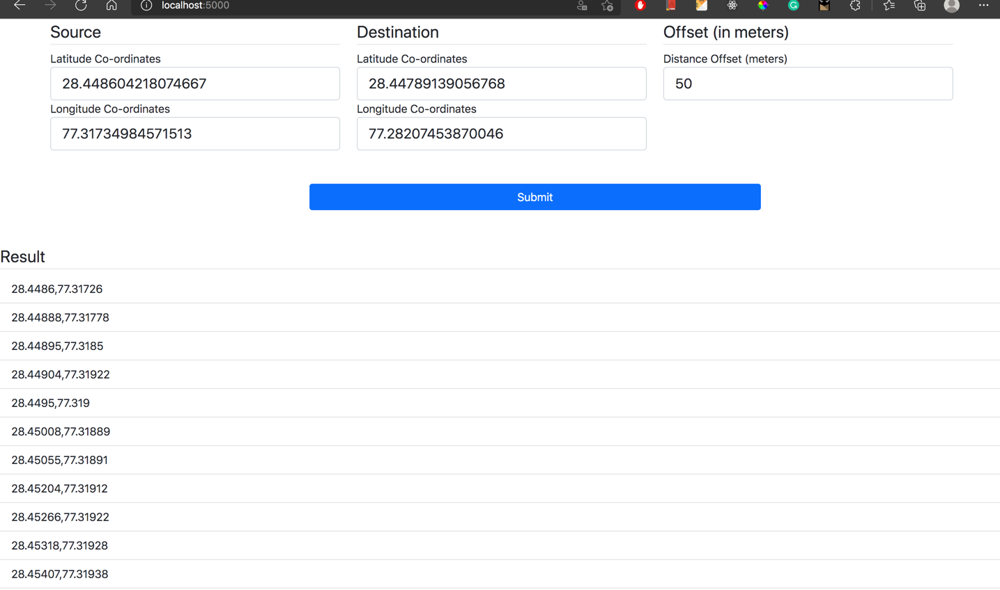

# Location Simulator Application

## Problem Statement
To get co-ordinates of latitude and longitude at a fixed interval of on the path in between a given source and destination's
LatLng co-ordinates.

## Proposed Solution
1. Get the route information using the Google directions API.
2. Filter out the 'Steps' from the API's response.
3. Each step has a entry for polyline point which is an encoded string formed by masking the sequential LatLang
   co-ordinates of the respective step. 
4. Pass the encoded polyline point through a decoder method to get a list containing sequential co-ordinates along the
respective step.
5. Start with the source co-ordinates and then traverse linearly through each co-ordinate generated in step 4. Calcuate 
the distance in between the adjacent co-ordinates.
6. Linearly filter out the co-ordinates which are at the offset distance in the resulting array.    

## File Structure
1. **[app.py](app.py)**: Entry point of the application. The application is bootstrapped in this file and all the business logic
related to data retrieval from the API is present here.
2. **[polylihne_decoder.py](polyline_decoder.py)**: Contains logic to decode the polyline point encoded string.
3. **[forms.py](forms.py)**: Contains class for Input form to accept source and destination co-ordinates as displayed in the UI.
4. **[constants.py](constants.py)**: Maintains the constants used in the application.
5. **[templates](templates)**: Contains HTML files which present the interface for user interactions like data input and displaying
output to the user.
6. **[static](static)**: Contains static files like CSS and JS(if present) in the application.
7. **[location-simulator.sh](location-simulator.sh)**: Shell script to pull the docker image of this application from the docker hub and spin up
the container in docker.
8. **[requirements.txt](requirements.txt)**: Contains all the application's dependencies to be installed. 
9. **[Dockerfile](Dockerfile)**: Contains configuration to create docker image for this application.

## Run this application
This application is developed using Flask framework in Python. A docker image of current version of this application is
also available. Apart from running the docker container, this application can be setup locally to execute.

### Docker image
#### Steps:
**Prerequisite**: System should have docker installed and docker daemon should be active and running. Please check `sudo`
is not required while executing any docker commands.

Execute the [location-simulator.sh](location-simulator.sh) file, present in the root directory.

NOTE: You might need to add execute permission to that script.
1. `chmod +x location-simulator.sh`
2. `./location-simulator.sh`
3. Open the application in browser at http://localhost:5000/

### Screenshots

